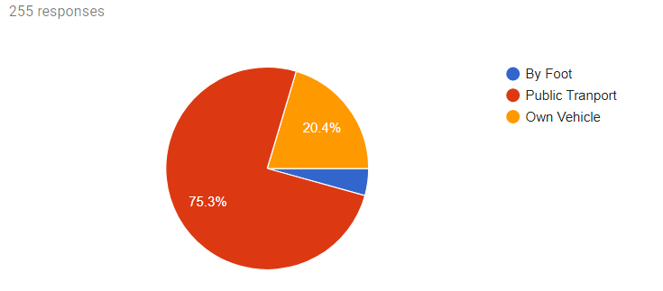

# Restaurant-Recommendation-System-Gwalior-City-Binary-Dragonfly-Algorithm
Restaurant Recommendation is a blooming sector in the e-commerce industries because of the high financial surplus returns provided by it. Because of the expanding and befuddling choices of diners and restaurants, people get confounded to choose any restaurants when they go out for dinner. Recommender structures deal with this issue by means of looking for through immense volume of logically delivered information to give customers redid substance and organizations. 

This research is based on restaurant recommendation for the people of Gwalior city. 100 Restaurants were selected and dataset was constructed through a survey conducted through myself and dataset utilizes around 3200 ratings provided by the 255 people of the city. Recommender systems, these days, are not just again individual recommender systems, rather they are group recommender systems which drill down proposals for a social occasion of customers. Regardless of the way that we can't collect a recommender system for every individual, we can manufacture a recommender structure which considers the tendencies of a get-together of customers. Altered Client Based Collaborative Filtering is a new approach which earlier used the Dragonfly Algorithm, however there was an scope to improve the accuracy of the recommender systems. This research focuses on using a fresh swarm intelligence algorithm known as Binary Dragonfly Algorithm along with Altered Client Based Collaborative Filtering which increased the accuracy of the recommender system.\\\\
Keywords: Restaurant Recommendation, Group Recommendation systems, Collaborative Filtering, Content Based Filtering, Altered Client Based Collaborative Filtering, Binary Dragonfly Algorithm.

 
 
 Menu of the Algorithm:
 
 Personality Classification Result:
 
 Preference Aggregation Result:
 
 Neighbor Identification in BDA:
 
 
 
 Results: The following four parameters were taken as results and values were obtained as follows:
 1. Root Mean Square Error: Root Mean Square Error was less in Binary Dragonfly Version.
  
  
 2. Precision: Precision was more in Binary Dragonfly Version.

3. Coverage: Coverage was more in Binary Dragonfly Version.
  

4. F-Measure: F-Measure was more in Binary Dragonfly Version.
  

Dataset: A new dataset based on Gwalior city was constructed using a Survey conducted through Google Forms. The following steps were executed to construct dataset for this Research:
   
   1. A list of 100 Restaurants of Gwalior city was created from Internet and using food delivery applications in categories of Cafe,Hotels,Restaurants and eateries.
   
   2. Various information such as alcohol served or not,smoking allowed or not, price range, vegetarian or non vegetarian were collected from all the restaurants.
   
   3. A Survey was conducted using Google Forms listing all the restaurants and users were asked to provide their preferences like smoke or not, drink alcohol socially or frequently or never, activity they do like study or work,their budget for restaurants etc.
   
   4. Users were also asked to rate these 100 restaurants in values of 0 to 2, with 0 for lowest, 1 for medium and 2 for highest rating.
   
   5. 255 users participated in the Survey and rated the restaurants, around 3200 ratings were obtained.
    
    Users Data
 
   
   Restaurant Data:
 
   
   Cuisines in Restaurants:
 
   
   Ratings given by Users:
 
 
 Alcohol Preferences
 
 
 Birth Years:
 
 
 Budget:
 

Cuisines choices of Users:
 

Dress Preferences:
  

Family/Friends Ambience Preferences:
  

Payment Preferences by Users:
  

Smoking Preferences:
  

Transport Choices for visiting restaurants:
  

Vegetarian / Non-Vegetarian Preferences:
  
 
